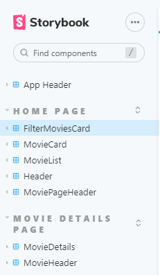
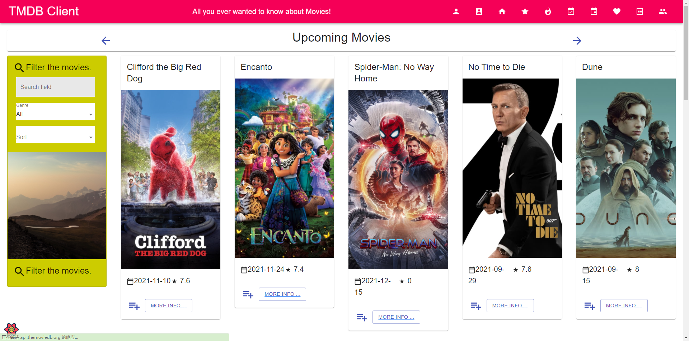
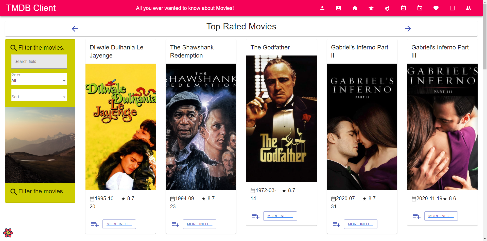
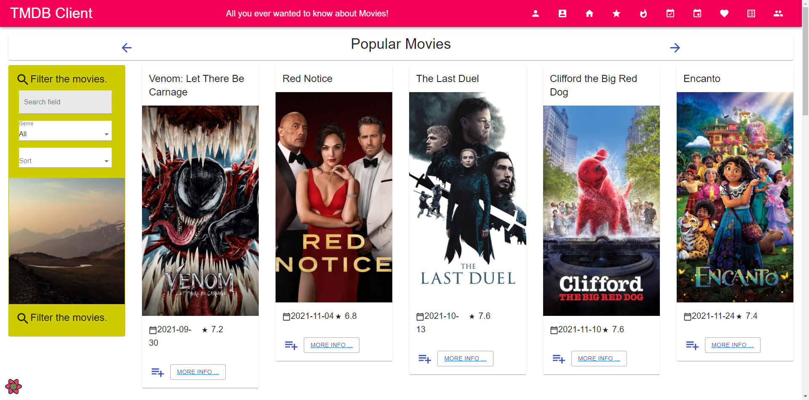
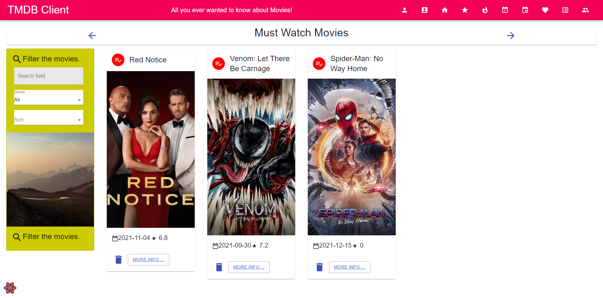
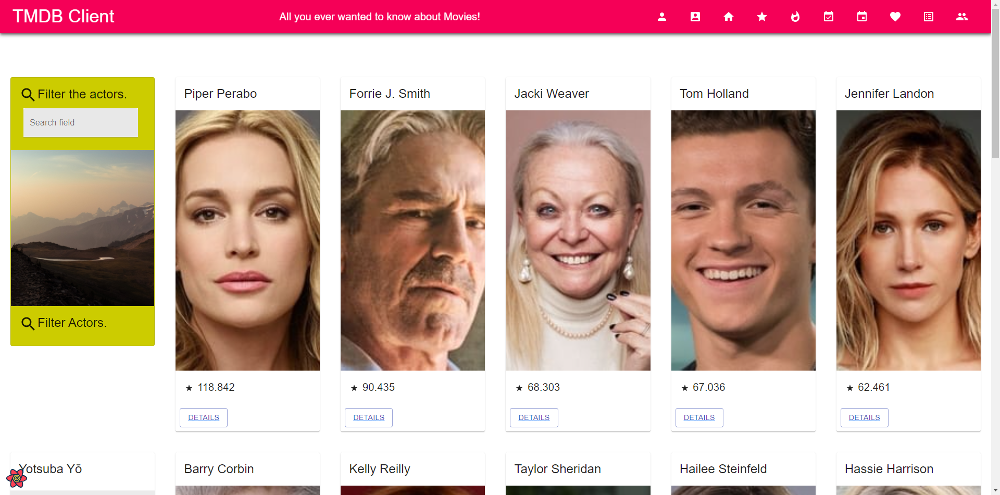
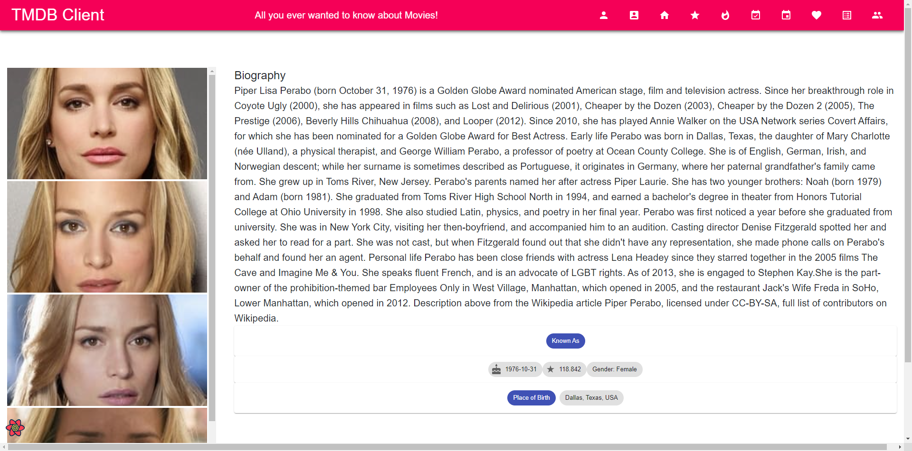
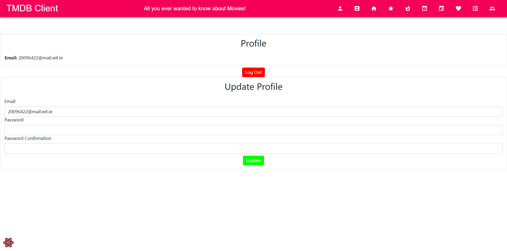
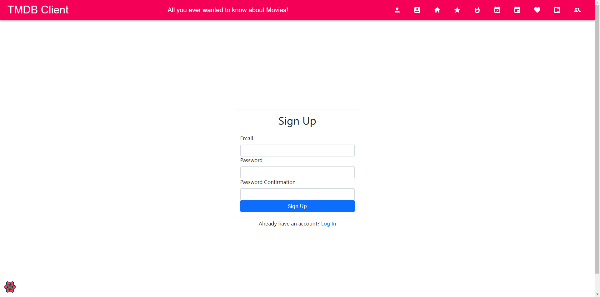
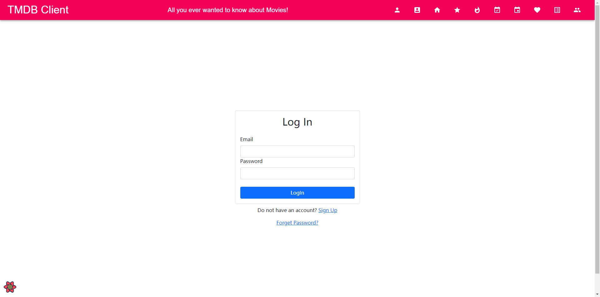

# Assignment 1 - ReactJS app.

Name: Xin Ji

## Overview.

This repository is for the Assgnment 1 of both Web App Development and Agile Software Practice, including all lab work and some new features and views.

### Features.

+ Now Playing Movies Page
+ Popular Movies Page
+ Top Rated Movies Page
+ Authentication base on Firebase
+ Movies Sorting
+ Add to must watch movies and remove from them
+ Actors Page
+ Actor Details Page

## Setup requirements.

Run following commands to prepare environment :
npm install 
npm install bootstrap
npm install firebase
npm install --save-dev http-server@13.0.2
npm install --save-dev start-server-and-test@1.14.0

Create .env file in root directory and fill in the api key:
REACT_APP_TMDB_KEY=

## API endpoints.

+ Upcoming Movies - /movies/upcoming
+ Top Rated Movies - /movies/top_rated
+ Popular Movies - /movies/popular
+ Now Playing Movies - /movies/now_playing
+ Actors List - actors/home
+ Actor - actors/:id

## App Design.

### Component catalogue.

 No New Storybook Components

### UI Design.

Upcoming movies page shows all movies which will be released soon.

Top rated page shows the movies on tmdb with the highest ratings.

Popular movies page shows all the currently trending movies.

Now playing page shows all the movies which have been released recently.

Must watch page shows all the movies a user has added to his must watch list.

Actor page shows all the popular actors , clicking details will bring you to the actor details page .

Actor details page shows the actors biography and other details.

Account page lets the user to logout , update his email or update his password.

Signup page which uses authentication by firebase.

Login page which uses authentication by firebase.

### Routing.
 
+ Top Rated Movies - /movies/top_rated              
+ Popular Movies - /movies/popular                  
+ Now Playing Movies - /movies/now_playing         
+ Upcoming Movies - /movies/upcoming 
+ List of must watch movies - /movies/mustwatch             
+ List of Actors - /actors/home                 
+ Actor details - /actors/:id                       
+ Account details/settings - /account               
+ Signup Page - /signup               
+ Login Page - /login    

## Independent learning (If relevant).

+ [TMDB API](https://developers.themoviedb.org/3).
+ [FIREBASE](https://firebase.google.com/docs/web/setup?authuser=0)
